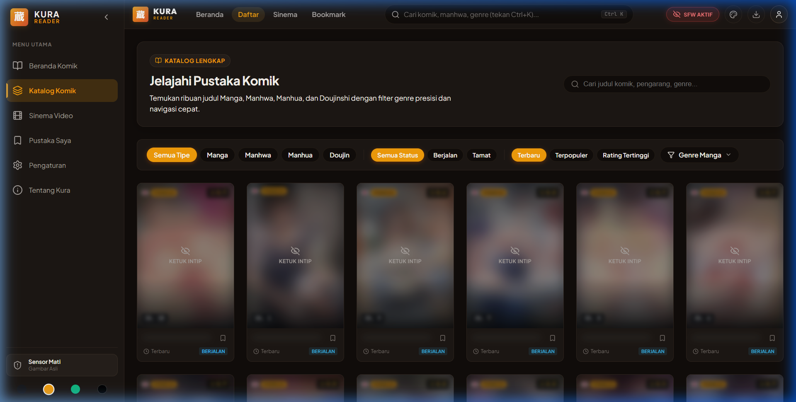
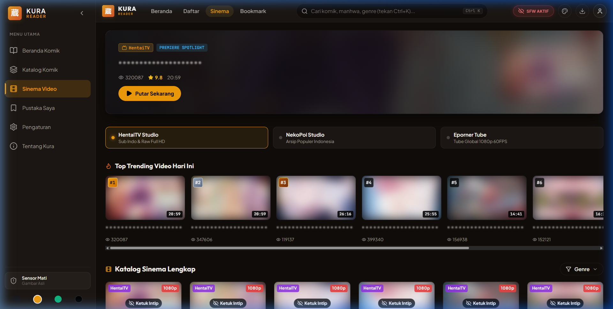
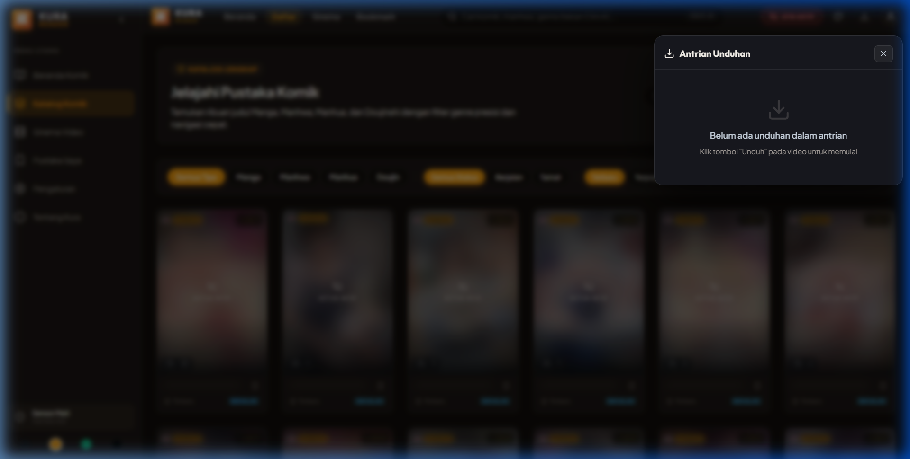
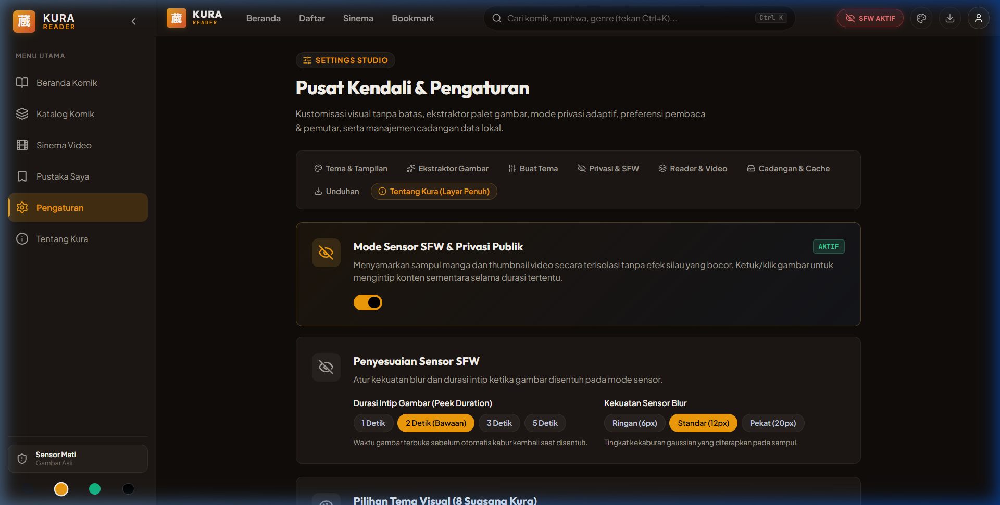

<div align="center">

  

  <p><strong>Your private, self-hosted sanctuary for manga reading, anime streaming, and media archiving.</strong></p>
  <p><em>Khazanah media mandiri — hening, cepat, hemat sumber daya, dan bebas dari iklan.</em></p>

  <p>
    <a href="LICENSE"></a>
    <a href="https://nodejs.org"></a>
    
    
    
  </p>

  <br />

  

</div>

---

## 📸 Interface Showcase (SFW Privacy Mode)

Kura features a built-in **SFW Privacy Engine** that automatically softens adult covers with smooth gaussian blurs and shields explicit titles in public environments. Below are authentic screenshots of the running application:

| 📖 Manga Catalog & Adaptive Filtering | 🎬 Cinema Streaming & Video Rails |
|:---:|:---:|
|  |  |
| **📥 IDM-Style Download Queue Drawer** | **⚙️ Settings Studio & SFW Privacy Gauges** |
|  |  |

---

## 📖 Overview

**Kura (蔵)** — named after the traditional Japanese storehouses designed to safeguard precious valuables from fire and theft — is a high-performance, private, self-hosted web application and scraping engine for manga, anime, and video media.

Engineered from the ground up with a **privacy-first and zero-annoyance philosophy**, Kura eliminates intrusive gambling advertisements, malicious popunders, and third-party trackers. All reading history, bookmarks, offline chapters, and preferences stay strictly within your own self-hosted environment.

---

## ✨ Key Capabilities & Highlights

### 📖 Immersive Manga & Comic Reader
- **Multi-Layout Reading**: Seamlessly switch between **Webtoon / Long-Strip Vertical Scroll**, **Single Page**, and **Double Page** spread modes.
- **Smart Reading State & History Covers**: Automatically persists your reading progress and manga cover art to local storage with anti-hotlink headers (`no-referrer`), ensuring clean display on "Lanjutkan Membaca" and "Pustaka".
- **Predictive Background Pre-fetching**: Silently preloads upcoming chapter pages for instantaneous, zero-wait transitions.
- **Zero Distraction HUD**: Floating controls that auto-hide while reading, leaving only pure art.

### 🎬 Cinema & Video Streaming
- **Multi-Provider Unified Feed (Semua Studio)**: Concurrently queries HentaiTV, NekoPoi, and Eporner with `Promise.allSettled`, deduplicating identical titles (`title + type`) with an intuitive source switcher.
- **Direct Mount & Sandbox Shield**: Direct mounting for verified trusted hosts (`nhplayer.com`, `playmogo.com`, `streampoi.com`, `yandex.ru`) preventing PHP session loss, paired with automated ad-shielding for untrusted embeds.
- **DNS over HTTPS (DoH) Built-in**: Cloudflare DoH integration in `src/http.js` that effortlessly bypasses local ISP DNS poisoning (`internetpositif.id`) while enforcing strict SSRF and DNS Rebinding security.
- **Full Refresh Persistence**: Complete URL state management (`?tab=video&view=video-watch&slug=...&provider=...`) with Service Worker `ignoreSearch: true` support.
- **Provider-Isolated Recommendations**: Video recommendations stay strictly isolated to the currently active provider.
- **Full CJK Multi-Language Typography**: Complete native font fallback stack supporting Japanese (日本語), Chinese (中文), and Korean (한국어) without missing glyph boxes (□).

### 🛡️ 3-Tier Anti-Ad & Sandbox Shield
- **Tier 1 (Direct Stream Resolution)**: Resolves direct MP4 streams via curl TLS fallback, bypassing browser popunders entirely.
- **Tier 2 (Iframe Sandbox & Shims)**: Reverse-proxies third-party players through strict Content-Security-Policy headers (`sandbox allow-scripts allow-forms allow-presentation`) and injects ad-defusing shims (`stealthShim`/`guardShim`) to suppress popups.
- **Tier 3 (Domain Allowlisting)**: Prevents malicious domain redirections and rogue advertising networks from hijacking your tabs.

### ⚡ Smart Multi-Tier Client Caching
- **Instant 0ms Switching**: An in-memory LRU cache serves catalog and detail pages instantly during navigation.
- **Persistent Web Cache Storage**: Offline-capable IndexedDB and Web Cache API (`kura-api-cache-v1`) storage with user-adjustable TTL presets (15 min, 1 hour, 6 hours, 24 hours).
- **Zero Server Pressure**: Eliminates repeated upstream scraping calls and reduces bandwidth consumption to a minimum.

### 📥 IDM-Style Download Manager
- **Dual-Mode Engine**: Choose between **Browser Direct Download** (saved directly to your device) or **Server Disk Storage** (streamed directly to host filesystem).
- **Live Queue Drawer**: Floating management drawer featuring Pause, Resume, Cancel, and Retry controls.
- **Realtime SSE Telemetry**: Progress percentage, transfer rate, and download states pushed via Server-Sent Events (`/api/downloads/events`).
- **Automated Archiving**: Manga chapters are automatically bundled into clean `.zip` archives.

### 💾 Local File Offline Hub
- **Direct Drag & Drop**: Upload `.zip`, `.cbz`, and `.mp4` files from your local storage directly into the web interface.
- **Client-Side Extraction**: Unpacks and renders comic archives on-the-fly inside your browser without uploading to the server disk.

### 📱 Progressive Web App (PWA)
- **Standalone App Experience**: Installable directly to your home screen or desktop via Chrome, Safari, Edge, or Firefox.
- **Full Offline Reading**: Save entire chapters to IndexedDB for offline reading on trains, flights, or off-grid travels.

---

## ⌨️ Keyboard Shortcuts

Kura provides full keyboard navigation for both reader and media player modes:

| Mode | Shortcut | Action |
|:---|:---|:---|
| **Reader** | <kbd>→</kbd> / <kbd>D</kbd> | Next Page / Scroll Down |
| **Reader** | <kbd>←</kbd> / <kbd>A</kbd> | Previous Page / Scroll Up |
| **Reader** | <kbd>Shift</kbd> + <kbd>→</kbd> | Jump to Next Chapter |
| **Reader** | <kbd>Shift</kbd> + <kbd>←</kbd> | Jump to Previous Chapter |
| **Reader** | <kbd>F</kbd> | Toggle Fullscreen Mode |
| **Reader** | <kbd>W</kbd> | Toggle Webtoon / Paginated Layout |
| **Player** | <kbd>Space</kbd> / <kbd>K</kbd> | Play / Pause Video |
| **Player** | <kbd>J</kbd> / <kbd>L</kbd> | Seek Backward / Forward 10 Seconds |
| **Player** | <kbd>M</kbd> | Mute / Unmute Audio |
| **Global** | <kbd>Esc</kbd> | Close Overlay / Reader / Return to Details |

---

## 🚀 Quick Start

### Option A: Using Docker (Recommended)

Run Kura in an isolated container with a single command:

```bash
# Clone the repository
git clone https://github.com/Ackerman237/self-hosted-manga-and-anime.git
cd self-hosted-manga-and-anime

# Launch via Docker Compose
docker compose up -d
```

Open `http://localhost:4000` in your web browser.

---

### Option B: Local Node.js Setup

#### 1. Prerequisites
- **Node.js** `≥ 18.17 LTS`
- `curl` available on system PATH (for upstream video stream resolution)

#### 2. Installation & Launch
```bash
# 1. Clone repository
git clone https://github.com/Ackerman237/self-hosted-manga-and-anime.git
cd self-hosted-manga-and-anime

# 2. Copy environment configuration
cp .env.example .env

# 3. Install dependencies (zero production runtime dependencies)
npm install

# 4. Build frontend client bundle
npm run build:web

# 5. Start the server
npm start
```

Visit `http://localhost:4000` to start using Kura.

---

### 🧪 Running Automated Tests

Kura includes a comprehensive test suite covering scrapers, security policies, and parsers:

```bash
# Execute the unit and integration tests under `test/`
npm test
```

---

## 🏗️ Architecture & Project Layout

```text
self-hosted-manga-reader/
├── docs/                        # Architectural blueprints, security, & design tokens
│   └── assets/branding/         # Kura logos and UI showcase mockups
├── src/
│   ├── sources/                 # Modular scrapers (Doujindesu, NekoPoi, HentaiTV, Eporner)
│   │   └── <provider>/
│   │       ├── parser.js        # Pure DOM/JSON parsing (no network dependency)
│   │       ├── client.js        # Secure HTTP client with SSRF mitigation
│   │       └── index.js         # Unified facade export
│   └── web/                     # Vue 3 Frontend Client
│       ├── components/          # Reusable UI components (Reader, Player, Library, Drawer)
│       ├── services/            # Client cache (LRU + Web Cache), local file extractor, API
│       ├── views/               # Dedicated full-screen views (Catalog, Details, Watch)
│       └── App.vue              # Core root view with reactive screen navigation
├── server.js                    # Express backend, streaming proxy, & SSE download engine
├── CREDITS.md                   # Third-party scraper source acknowledgments & legal disclaimer
├── LICENSE                      # GNU General Public License v3.0
└── package.json
```

---

## 🤝 Credits & Acknowledgments

Kura acknowledges and credits community scraper engines, upstream platforms, and open-source libraries. For detailed source attribution, provider scopes, and DMCA guidelines, please see [CREDITS.md](CREDITS.md).

---

## ⚖️ License

This project is licensed under the **[GNU General Public License v3.0 (GPL-3.0)](LICENSE)**.

```text
Kura (蔵) — Self-Hosted Manga Reader & Video Streaming Engine
Copyright (C) 2026 Kura Contributors & Hengki

This program is free software: you can redistribute it and/or modify
it under the terms of the GNU General Public License as published by
the Free Software Foundation, either version 3 of the License, or
(at your option) any later version.
```
